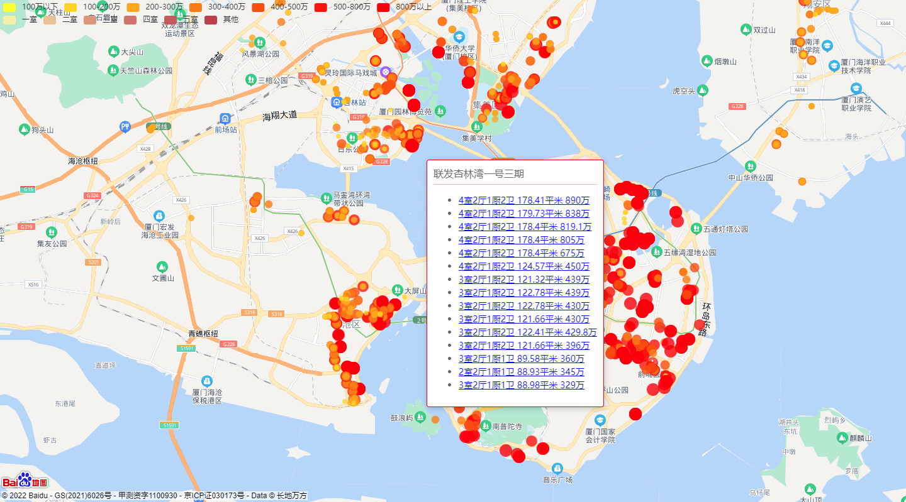

# 链家二手房爬虫
- [链家二手房爬虫](#链家二手房爬虫)
  - [介绍](#介绍)
  - [安装教程](#安装教程)
  - [使用说明](#使用说明)

## 介绍
链家二手房爬虫，echarts可视化


> python爬虫

> echarts可视化 

> Fastapi Web 

## 安装教程
```shell
pip install -r requirements.txt
```

## 使用说明

> 获取数据
```shell
python house_data.py
```

> Web
```shell
python house_data.py
```